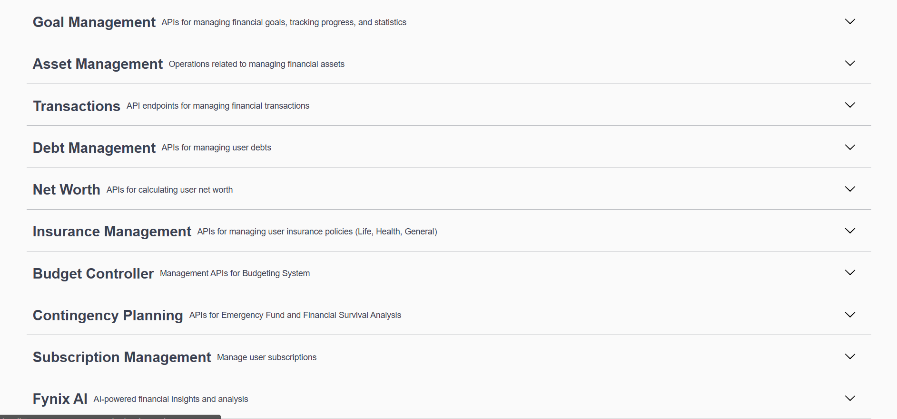

# 💰 Intelli Wealth - Backend API


**Intelli Wealth** is a modular personal finance engine built with Spring Boot. It provides a comprehensive set of RESTful APIs to track wealth, manage liabilities, calculate financial health metrics, and generate AI-driven insights via the custom **Fynix** engine.

This repository hosts the **backend core**, focusing on domain-driven design and a clean "Package-by-Feature" architecture.

> **Current Status:** 🚧 Active Development. (Security layers and Frontend integration are planned for future updates).

---

## 🔌 API Documentation & Architecture

The application exposes a fully documented REST API via **Swagger UI**.

### API Modules
The backend is divided into distinct functional domains as seen in the API interface:

* **Fynix AI:** Intelligent financial chat and summary generation.
* **Wealth Management:** Net worth aggregation, Asset tracking, and Debt management.
* **Protection:** Insurance policy tracking and Contingency (Emergency Fund) planning.
* **Core Finance:** Budgeting, Goals, Transactions, and Subscriptions.


---

## 🌟 Key Features

### 🧠 Fynix AI Module
* **Financial Chatbot:** `FinancialChatController` handles context-aware queries about user data.
* **Smart Summaries:** Automated extraction of key financial metrics and recommendations.
* **Prompt Engineering:** Custom `FynixPromptBuilder` and `AiJsonExtractor` for structured AI responses.

### 🛡️ Protection & Contingency
* **Insurance Engine:** Manages Life, Health, and General insurance with specific attributes (frequency, premium, coverage).
* **Contingency Planning:** Specialized logic to calculate financial survival capability in months based on liquid assets.

### 📈 Wealth Management
* **Asset & Debt Tracking:** Dedicated controllers for managing Assets (`Real Estate`, `Gold`, `Mutual Funds`) and Liabilities.
* **Net Worth Engine:** Real-time calculation service that aggregates data from Asset and Debt repositories.
* **Attribute Rules:** Dynamic validation rules for different asset/debt categories.

### 💸 Core Services
* **Smart Budgeting:** Compare actual spending against defined budgets.
* **Goal Tracking:** Monitor progress toward specific financial targets (e.g., "Buy a House").
* **Subscription Manager:** Tracks recurring payments to identify fixed monthly costs.

---

## 🛠️ Tech Stack

| Component | Technology |
| :--- | :--- |
| **Language** | Java 21 |
| **Framework** | Spring Boot 3.x |
| **Database** | PostgreSQL |
| **AI Integration** | Custom AI Service / Ollama (Local) |
| **Documentation** | Swagger / OpenAPI 3.0 |
| **Build Tool** | Maven |
| **Architecture** | Modular Monolith (Package-by-Feature) |

---

## 📂 Project Structure

The project utilizes a **Package-by-Feature** directory structure to ensure high cohesion and modularity.

```text
src/main/java/com/example/intelliwealth
├── config              # Global Configuration (AI, Swagger, Web, Currency)
├── core
│   ├── budget          # Budgeting logic
│   └── goal            # Financial Goals management
├── wealth
│   ├── asset           # Asset tracking & attribute rules
│   ├── debt            # Liability management
│   └── networth        # Aggregation logic
├── protection
│   ├── insurance       # Insurance policies & validation
│   └── contingency     # Emergency fund calculations
├── fynix               # AI Module
│   ├── controller      # Chat API endpoints
│   ├── service         # AI Context processing
│   └── util            # JSON extractors & Prompt builders
├── subscription        # Recurring expense management
├── transaction         # Core ledger (Income/Expense)
└── exception           # Global Exception Handling