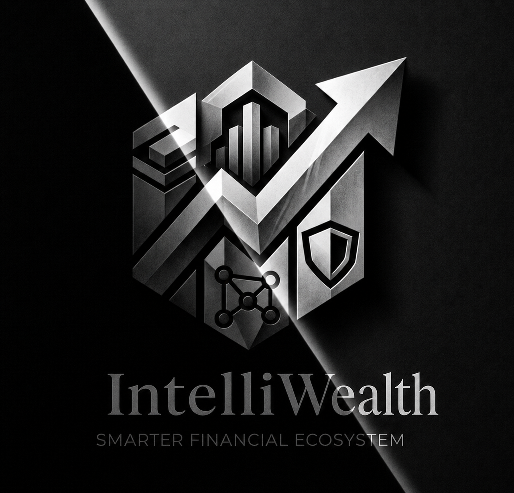

<div align="center">



# Intelli Wealth

### AI-powered personal finance management platform — built end-to-end as a solo engineering project

<p>


<br/>


</p>

**[Live API](https://intelliwealth-api.onrender.com/swagger-ui/index.html#/) &nbsp;·&nbsp; [Live Frontend](https://intelli-wealth-ui.netlify.app/) &nbsp;·&nbsp; [Frontend Repo](https://github.com/Aakashch-code/intelli-wealth-ui)**

</div>

<br/>

<div align="center">

| Endpoints | Architecture | Databases | AI Engine |
|:---:|:---:|:---:|:---:|
| **50+** REST endpoints | Layered · Modular Monolith | PostgreSQL + MongoDB | Google Gemini |

</div>

---

## Table of Contents

- [Overview](#overview)
- [Objective](#objective)
- [Live Demo](#live-demo)
- [Features](#features)
- [Architecture](#architecture)
- [Getting Started](#getting-started)
- [What This Project Demonstrates](#what-this-project-demonstrates)
- [Honest Limitations](#honest-limitations)
- [License](#license)
- [Author](#author)

---

## Overview

**Intelli Wealth** is a backend-first personal finance system designed and built end-to-end as a solo engineering project — demonstrating real-world API design, layered architecture, AI integration, and secure API design with JWT authentication, RBAC, BCrypt password hashing, and Spring Security.

The platform goes well beyond CRUD. It models core financial domains — transactions, budgets, goals, assets, debt, insurance, net worth, and contingency planning — with 50+ RESTful endpoints, a unified AI reporting layer powered by Google Gemini, and a thoughtfully structured layered architecture.

---

## Objective

Financial literacy is still a challenge for many people in India, and personal finances are often scattered across different places, making it difficult to get a clear picture of income, expenses, assets, debt, goals, and emergency readiness.

Intelli Wealth was built to bring these areas into one system — helping users manage their finances, understand their financial position, plan for emergencies, and get AI-assisted insights based on their own financial data.

---

## Live Demo

<table>
<tr>
<td><strong>Backend API (Swagger UI)</strong></td>
<td><a href="https://intelliwealth-api.onrender.com/swagger-ui/index.html#/">intelliwealth-api.onrender.com/swagger-ui</a></td>
</tr>
<tr>
<td><strong>Frontend Demo</strong></td>
<td><a href="https://intelli-wealth-ui.netlify.app/">intelli-wealth-ui.netlify.app</a></td>
</tr>
</table>

> **Note:** Demo runs on a lightweight VM. Expect cold starts and slightly slower AI responses.

### Frontend Repository

The React frontend is intentionally minimal — it exists to authenticate users, exercise every secured endpoint, and validate full end-to-end workflows.

**Repo:** [github.com/Aakashch-code/intelli-wealth-ui](https://github.com/Aakashch-code/intelli-wealth-ui) &nbsp;|&nbsp; **Stack:** React.js · Axios · JWT auth handling

---

## Features

<table>
<tr valign="top">
<td width="50%">

### Secure API Design
- JWT authentication with Spring Security 6
- Role-based access control (RBAC)
- BCrypt password hashing
- Token refresh flow & security filter chain

### AI Financial Insights (Google Gemini)
- Structured pipeline: **financial data → aggregation/analysis → Gemini → structured financial insight**
- Raw data is first aggregated and analyzed server-side, then sent to Gemini as a clean JSON payload — not a raw chatbot passthrough
- Prompt-engineered for consistent, finance-specific responses (spending behaviour analysis, debt strategy recommendations)
- Payloads trimmed with `@JsonInclude(JsonInclude.Include.NON_NULL)` so Gemini only receives populated fields

### Treasury Management
- Budgets, transactions, and subscriptions
- Goal tracking and spending analytics
- 50+ RESTful endpoints covering the full financial lifecycle

</td>
<td width="50%">

### Contingency Analysis API
- Computes **monthly burn rate**, **liquid assets**, and **financial runway** from aggregated data
- Identifies **recommended savings gap** to reach target emergency coverage
- Driven by a dedicated analytical endpoint, not just raw CRUD

### Wealth Management
- Asset and liability tracking
- Net worth aggregation
- Category-based classification

### Protection Planning
- Insurance tracking
- Emergency fund planning
- Survival-period estimation and coverage gap detection

</td>
</tr>
</table>

---

## Architecture

Intelli Wealth follows a **layered architecture** applied within a **modular monolith** structure — each financial domain owns its full vertical slice.

```
┌────────────────────────────────────────────────────────┐
│                        API Layer                       │
│         REST Controllers · Swagger Docs · DTOs         │
├────────────────────────────────────────────────────────┤
│                   Application Layer                    │
│    Business Logic · Gemini AI Service · Analytics      │
├────────────────────────────────────────────────────────┤
│                     Domain Layer                       │
│      Entities · Domain Models · Business Rules         │
├────────────────────────────────────────────────────────┤
│                  Persistence Layer                      │
│  PostgreSQL (Transactional)  │  MongoDB (Wealth & Protection) │
└────────────────────────────────────────────────────────┘
```

### Layer Responsibilities

| Layer | Responsibility |
|---|---|
| **API** | Exposes 50+ REST endpoints; handles request/response mapping, Swagger docs, and input validation |
| **Application** | Orchestrates business workflows, Gemini AI calls, contingency calculations, and cross-domain aggregations |
| **Domain** | Encapsulates core financial rules — net worth computation, runway estimation, coverage gap detection |
| **Persistence** | Polyglot persistence — PostgreSQL for user/transactional and treasury data; MongoDB for wealth and protection data (assets, liabilities, insurance, contingency records) |

### Package Structure

```
com.example.intelliwealth
├── authentication       # JWT, Spring Security, RBAC
├── treasury             # Budgets, Transactions, Goals, Subscriptions
├── wealth               # Assets, Liabilities, Net Worth
├── protection           # Insurance, Emergency Fund, Contingency
├── advisor              # Gemini AI reporting & unified insights
├── config               # Security config, Beans, Jackson setup
└── exception            # Global error handling
```

---

## Getting Started

### Prerequisites

| Requirement | Version |
|---|---|
| Java | 21+ |
| Maven | 3.8+ |
| PostgreSQL | 15+ |
| MongoDB | 6+ |
| Google Gemini API Key | — |

<details>
<summary><strong>Application Properties (click to expand)</strong></summary>

```properties
# Application Configuration
spring.application.name=Intelli-Wealth
server.port=8085

# Database Configuration (PostgreSQL)
spring.datasource.url=<YOUR_POSTGRES_URL>
spring.datasource.username=<YOUR_POSTGRES_USERNAME>
spring.datasource.password=<YOUR_POSTGRES_PASSWORD>

# Hikari Connection Pool Configuration
spring.datasource.hikari.maximum-pool-size=10
spring.datasource.hikari.minimum-idle=2
spring.datasource.hikari.idle-timeout=300000
spring.datasource.hikari.max-lifetime=600000
spring.datasource.hikari.connection-timeout=30000
spring.datasource.hikari.validation-timeout=5000
spring.datasource.hikari.keepalive-time=300000

# JPA/Hibernate Configuration
spring.jpa.hibernate.ddl-auto=update
spring.jpa.open-in-view=false
spring.jpa.show-sql=true
spring.jpa.properties.hibernate.dialect=org.hibernate.dialect.PostgreSQLDialect

# Security Configuration
application.security.jwt.secret-key=<YOUR_JWT_SECRET_KEY>

# Cache Configuration (Redis)
spring.cache.type=redis
spring.data.redis.port=6379
spring.data.redis.timeout=60s
spring.data.redis.ssl.enabled=true
spring.data.redis.url=<YOUR_REDIS_URL>

# MongoDB Configuration
spring.data.mongodb.uri=<YOUR_MONGODB_URI>
spring.data.mongodb.username=<YOUR_MONGO_USERNAME>
spring.data.mongodb.password=<YOUR_MONGO_PASSWORD>

# AI Configuration
gemini.api.key=<YOUR_GEMINI_API_KEY>

# Swagger Configuration
springdoc.swagger-ui.path=/docs
springdoc.swagger-ui.filter=true
springdoc.swagger-ui.operationsSorter=method
springdoc.swagger-ui.tagsSorter=alpha
```

</details>

### Run Locally

```bash
mvn clean install
mvn spring-boot:run
```

Swagger UI available at:

```
http://localhost:8085/swagger-ui/index.html
```

---

## What This Project Demonstrates

| Concern | Implementation |
|---|---|
| **API Design** | 50+ RESTful endpoints with clear resource boundaries and consistent response contracts |
| **Layered Architecture** | API → Application → Domain → Persistence with no cross-layer leakage |
| **Secure API Design** | Spring Security 6, JWT authentication, RBAC, BCrypt password hashing |
| **AI Integration** | Financial data is aggregated and analyzed, then passed to Gemini as structured JSON to generate financial insights, debt strategies, and behavioural analysis — not a generic chatbot |
| **Polyglot Persistence** | PostgreSQL for user/transactional and treasury data; MongoDB for wealth and protection data |
| **Analytical APIs** | Contingency engine computing burn rate, runway, and savings gap from aggregated data |
| **Response Optimisation** | `@JsonInclude(JsonInclude.Include.NON_NULL)` for clean, null-free AI payloads |

---

## Honest Limitations

- UI is intentionally minimal — the focus is backend correctness
- No automated tests yet (planned)
- No production observability (rate limiting, metrics, tracing)
- AI response quality depends on prompt design and Gemini model version

---

## License

Distributed under the **MIT License**.

---

## Author

<div align="center">

**Aakash Chauhan**
Backend Developer · Java · Spring Boot · System Design

Thank you for exploring Intelli Wealth.
Feedback and thoughtful discussion on design and implementation choices are always welcome.

</div>
